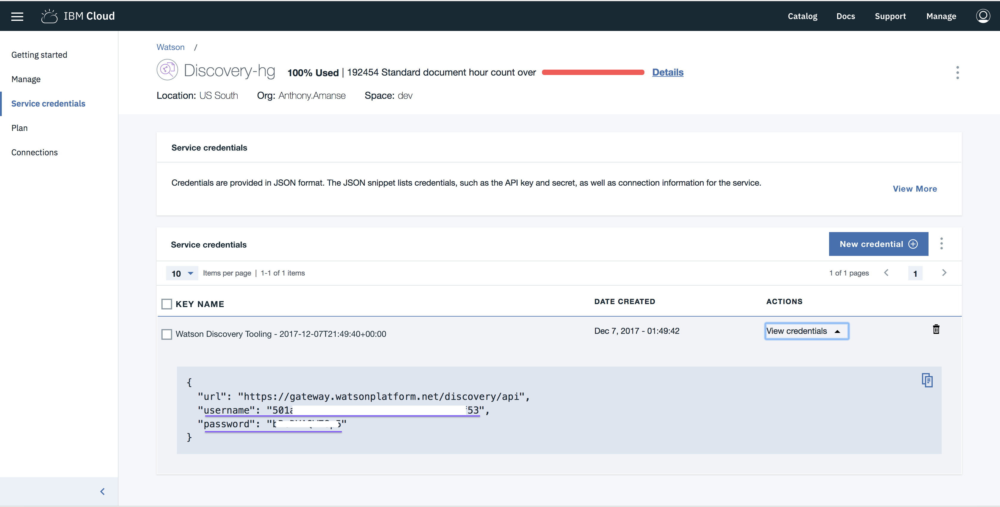
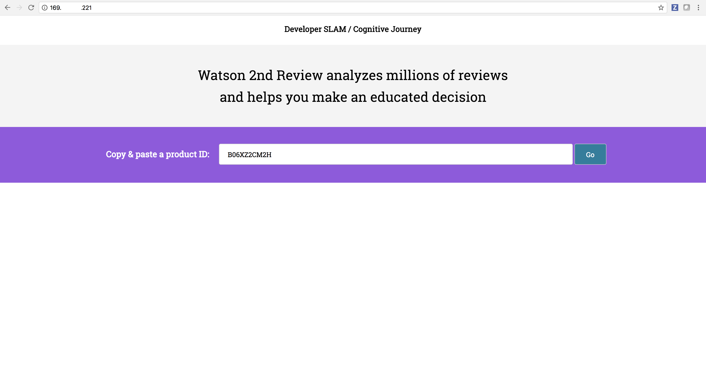
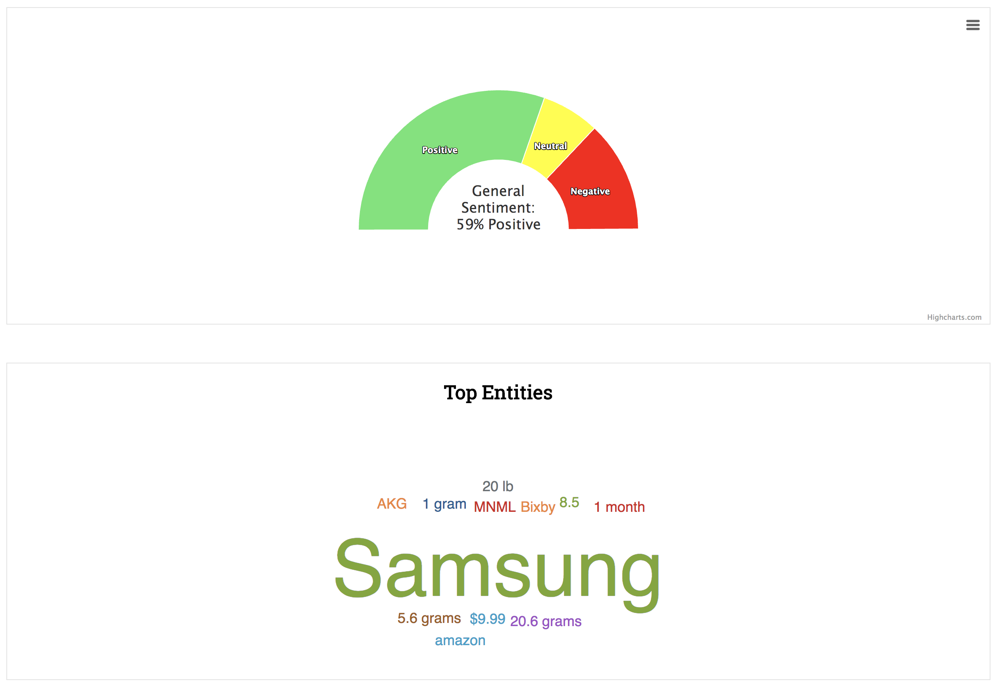

[](https://travis-ci.org/IBM/watson-review-analyzer)

# Create a Review Analyzer with Watson Discovery

In this Code Pattern, we will create a Node.js app that takes the reviews from an online shopping website, Amazon, and feeds them into the Watson Discovery service. The reviews will be stored in a Cloudant or couchdb database. The Watson Discovery service will show the overall sentiments of the reviews. The sample application will do all the reading of reviews for you and will give an overall insight about them. The Code Pattern can be useful to developers that are looking into processing multiple documents with Watson Discovery.

When the reader has completed this Code Pattern, they will understand how to:

* Interact with Watson Discovery using Watson's Node SDK
* Build a User Inerface around the result of Watson Discovery
* Deploy the app in Kubernetes
* Deploy and connect a CouchDB in the same instance of Kubernetes Cluster

<!--Remember to dump an image in this path-->


## Flow
1. The user deploys the app in Kubernetes. The user interacts with the User Interface of the app.
2. The user enters the product ID and the app would start getting the reviews of the Product.
3. The app then stores the reviews in a CouchDB database for later use.
4. The app starts to upload the reviews in Watson Discovery.
5. After Watson Discovery finishes processing the reviews, the app then stores the result (General Sentiment and Top Entities) in the CouchDB. The user will see the result in the UI.

## Included components
* [Watson Discovery](https://www.ibm.com/watson/services/discovery/):  A cognitive search and content analytics engine for applications to identify patterns, trends, and actionable insights.
* [Kubernetes Cluster](https://console.bluemix.net/containers-kubernetes/catalogCluster): Create and manage your own cloud infrastructure and use Kubernetes as your container orchestration engine.

## Featured technologies
* [Node.js](https://nodejs.org/): An open-source JavaScript run-time environment for executing server-side JavaScript code.
* [Databases](https://en.wikipedia.org/wiki/IBM_Information_Management_System#.22Full_Function.22_databases): Repository for storing and managing collections of data.
* [Cloud](https://www.ibm.com/developerworks/learn/cloud/): Accessing computer and information technology resources through the Internet.

# Prerequisite

Create a Kubernetes cluster with either [Minikube](https://kubernetes.io/docs/getting-started-guides/minikube) for local testing, or with [IBM Bluemix Container Service](https://github.com/IBM/container-journey-template/blob/master/README.md) to deploy in cloud. The code here is regularly tested against [Kubernetes Cluster from Bluemix Container Service](https://console.ng.bluemix.net/docs/containers/cs_ov.html#cs_ov) using Travis.

Install [Docker](https://www.docker.com) by following the instructions [here](https://www.docker.com/community-edition#/download) for your preferrerd operating system.  
You would also need a Docker Registry. [Docker Hub](https://hub.docker.com/) lets you create one quickly.

# Steps

1. [Clone the repo](#1-clone-the-repo)
2. [Create IBM Cloud services](#2-create-compose-for-mongodb-service-with-ibm-cloud)
3. [Build your images](#3-build-your-images)
4. [Configure Deployment files](#4-configure-deployment-files)
5. [Deploy the application](#5-deploy-the-application)
6. [Search for a product in Amazon](#6-search-for-a-product-in-amazon)

### 1. Clone the repo

```
$ git clone https://github.com/IBM/watson-review-analyzer
$ cd watson-review-analyzer/
```

### 2. Create IBM Cloud services

Create the following service:

* [**Watson Discovery**](https://console.ng.bluemix.net/catalog/services/discovery)
* [**IBM Cloud Kubernetes**](https://console.bluemix.net/containers-kubernetes/catalog/cluster)

### 3. Build your images

The Node.js app will be packaged into a Docker image. This will be used by the Kubernetes Cluster

```
$ docker build -t DOCKERHUB_USERNAME/watson-review-analyzer:1.0 .
$ docker push DOCKERHUB_USERNAME/watson-review-analyzer:1.0
```

### 4. Configure Deployment files
> Make sure you have set-up `kubectl` to use your cluster.

Add your Watson Discovery credentials in `config.json.sample` and rename it to `config.json`:



`config.json`:
```
{
  "discoveryUsername" : "YOUR_WATSON_DISCOVERY_USERNAME",
  "discoveryPassword" : "YOUR_WATSON_DISCOVERY_PASSWORD"
}
```

Create configmap in Kubernetes for `config.json`

```
$ kubectl create configmap watson-discovery-config --from-file=config.json
```

### 5. Deploy the application
<!--Deploy in kubernetes (1) nodejs app and (2) couchdb instance. Access via external ip-->

Deploy the CouchDB database. This is where the reviews and Watson Discovery results will be stored.

```
$ kubectl apply -f couchdb.yaml
```

Deploy the Watson Review Analyzer app.

```
$ kubectl apply -f watson-review-analyzer.yaml
```

You can access the application in the browser via the Load Balancer's IP (External IP).
If you don't have the Load Balancer enabled, you can access it through one of your Kubernetes' worker IP and service Node port of watson-review-analyzer.

<pre>
$ kubectl get service

NAME             CLUSTER-IP       EXTERNAL-IP      PORT(S)          AGE
couchdb          172.21.174.52    169.xy.xyz.220   5984:32402/TCP   13d
kubernetes       172.21.0.1       &ltnone&gt           443/TCP          27d
watson-reviews   172.21.254.246   <b>169.48.xyz.221</b>   80:<b>31385</b>/TCP     15m
</pre>

If you don't have the Load Balancer and need the worker IP:
<pre>
$ bx cs workers YOUR_CLUSTER_NAME

OK
ID                                                 Public IP       Private IP       Machine Type   State    Status   Zone    Version
kube-dal12-cr5c30966926aa444f9c02c72d5c3e1ca5-w1   <b>169.xy.xyz.35</b>   10.184.120.196   b2c.16x64      normal   Ready    dal12   1.8.6_1506*
</pre>

Go to `169.xy.xyz.221` or `169.xy.xyz.35:31385` (for clusters without a Load Balancer)



### 6. Search for a product in Amazon

To use the app, search for the product you want the reviews to be uploaded to Watson Discovery and get its product ID (ASIN).

`https://www.amazon.com/Samsung-Thinnest-Premium-Anti-Scratch-Protective/dp/`**`B06XZ2CM2H`**`/ref=cm_cr_arp_d_product_top?ie=UTF8`

In this case, the product ID is **B06XZ2CM2H**


Go ahead and press `Go`.

After Watson Discovery finishes processing all the reviews, the app should show you its General Sentiment and Top entities found.



# Learn more

* **Node.js Code Patterns**: Enjoyed this Code Pattern? Check out our other [Node.js Code Patterns](https://developer.ibm.com/code/technologies/node-js/)

# License
[Apache 2.0](LICENSE)